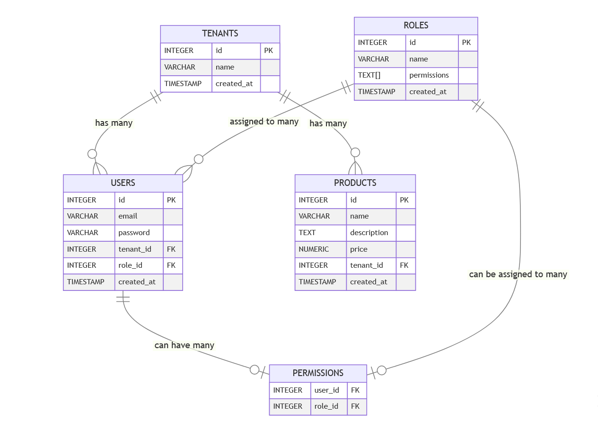

<h1 align="center"></h1>
<h2 align="center">Assessment for Sequenttal interview process</h2>

Click [here](https://github.com/omarAboElWafa/rbac-multi-tenants-system/blob/main/src/docs/system-requirments.md) to view System Requirment and Technical approach.
and [here](https://documenter.getpostman.com/view/17178333/2sA3XQhhEw) to view the API Documentation.

The Project is written with TypeScript on Node.js runtime depending on <strong >the dependency injection pattern </strong> to achieve scalability, maintainability, and simplicity of coding. I've used reliable technologies such as TypeScript, Node.js, Express, Redis, and PostgreSQL.

The API includes essential features that every API requires, such as Mailer, Authentication, Authorization, Rate Limiting, Pagination, DB Migration handling JWT Management and more.

## Structure of the project

<span>
<pre>
<br>
├── package-lock.json
├── package.json
├── src
|    ├── server.ts
|    ├── index.ts
|    ├── components
|    │   └── user
|    │   |    ├── user.controller.ts
|    │   |    ├── user.entity.ts
|    │   |    ├── user.module.ts
|    │   |    ├── user.router.ts
|    │   |    └── user.service.ts
|    │   |
|    |   └── tenant
|    │   |    ├── tenant.controller.ts
|    │   |    ├── tenant.entity.ts
|    │   |    ├── tenant.module.ts
|    │   |    ├── tenant.router.ts
|    │   |    └── tenant.service.ts
|    │   |_ permissions
|    │   |    ├── permissions.controller.ts
|    │   |    ├── permissions.entity.ts
|    │   |    ├── permissions.module.ts
|    │   |    ├── permissions.router.ts
|    │   |    └── permissions.service.ts
|    │   |
|    |   └── product
|    │   |    ├── product.controller.ts
|    │   |    ├── product.entity.ts
|    │   |    ├── product.module.ts
|    │   |    ├── product.router.ts
|    │   |    └── product.service.ts
|    │   |
|    |   └── role
|    │       ├── role.controller.ts
|    │       ├── role.entity.ts
|    │       ├── role.module.ts
|    │       ├── role.router.ts
|    │       └── role.service.ts
|    │
|    |
|    ├── config
|    │   ├── data-source.ts
|    │   ├── entities.ts
|    │   ├── env.ts
|    │   ├── role.ts
|    │   └── logger.ts (future)
|    │
|    ├── middlewares
|    │   ├── auth.ts
|    │   ├── authorization.ts
|    │   ├── index.ts
|    │   └── validation.ts
|    │
|    ├── contracts
|    │   ├── permissions.ts
|    │   ├── product.ts
|    │   ├── pagination.ts  (future)
|    │   ├── user.ts
|    │   |── tenant.ts    
|    │   └── mailer.ts   (future)
|    │
|    ├── docs
|    │   ├── folder-structure.md
|    │   └── README.md   
|    |
|    ├── libs
|    │   ├── schemas
|    │   |   ├── user.ts
|    │   |   ├── tenant.ts
|    │   |   ├── role.ts
|    │   |   ├── permissions.ts
|    │   |   └── shared.ts
|    │   |   └── product.ts
|    │   |
|    │   └── cache.ts
|    |
|    ├── loaders
|    │    |
|    |    ├── v1
|    │    |   └── routes.ts
|    │    └── index.ts  (future)
|    │
|    └── utils
|        ├── ApiError.ts
|        ├── ApiResponse.ts  (future)
|        ├── cryptoHelpers.ts
|        ├── hooks.ts  (future)
|        ├── loggers.ts  (future)
|        ├── mailService.ts (future)
|        └── sms.ts (future)
|
|
├── .env
├── .env.example
├── .gitignore
├── .prettierrc
├── .prettierignore
├── .prettierrc.json
├── .editorconfig
├── .eslintrc
├── .eslintignore
├── docker-compose.yml
├── Dockerfile
├── README.md
├── tsconfig.json
└── LICENSE

</pre>
</span>

### Database Schema

The database schema is designed to support multi-tenancy and RBAC. The following ERD image represents the database schema:


## Getting started

### Requirements

- Install [Docker](https://docs.docker.com/get-docker)
- Install [Node.js](https://nodejs.org/en/download/) version 16.14 or above (which can be checked by running `node -v`).
  You can use [nvm](https://github.com/nvm-sh/nvm) for managing multiple Node versions installed on a single machine.

### Fresh installation

#### Install dependencies

You can install dependencies using `npm`:

**_Using `npm`:_**

```bash
npm install
```

#### Manual setup

For the manual setup clone this repository

### Run existing project

#### Install dependencies

The project is configured to use npm workspaces, which means that you can install `node_modules` of all packages in
repository, with single command:

```sh
npm install
```

### Start the app

#### Start in Production mode

Edit the `.env` file and set the `NODE_ENV` to `production`.

then run the following commands:

```sh
docker compose build
docker compose up
```

#### Start in Development mode

Edit the `.env` file and set the `NODE_ENV` to `development`.

then run the following commands:

```sh
docker compose build
docker compose up
```

## Package Scripts

### The package.json includes the following scripts:

```json

"scripts": {
  "start": "ts-node src/index.ts",
  "start:prod": "node dist/index.js",
  "dev": "nodemon --exec ts-node src/index.ts",
  "build": "tsc -p .",
  "lint": "eslint . --ext .ts",
  "lint:fix": "eslint . --ext .ts --fix",
  "format": "prettier --write \"src/**/*.{ts,js,json,css,md}\""
}

```

## Tech stack

- Node.js
- Docker
- Docker Compose
- Redis
- Express
- Typescript
- PostgreSQL
- JWT
- Bcrypt

Infrastructure:

- Linux Ubuntu 20.04
- Github

3rd party services (Future expand):

- Twilio (SMS)
- NodeMailer (Emails)

## How was this project structured?

### Components

The application was divided into components. Each component has its own module, where we instantiate the controller, service, and router. This helps us keep our code clean and maintainable.

```js
const userService = new UserService();
const userController = new UserController(userService);
const userRouter = new UserRouter(userController);
```

---

### Entities

you’ll also have an entities file where you'll define the DB entities of your component.

```js
export default mongoose.model < IUser > ("User", UserSchema);
```

---

### Routers

Within the router, you should define the URLs of our backend API and call the corresponding controller functions to handle requests.

```js
class UserRouter {
  userController: UserController;
  constructor(UserController: UserController) {
    this.userController = UserController;
  }
  getRouter = () => {
    const router = Router();
    router.post(
      "/register",
      [checkPhone, checkEmail],
      this.userController.register
    );
  };

  // ... rest of the router methods
}
```

---

### Controllers

The controller receives incoming requests from the router and prepares the necessary parameters to call the appropriate service functions. Here, we define the logic for handling each API endpoint of our backend.

```js
class UserController {
  userService: UserService;
  constructor(UserService: UserService) {
    this.userService = UserService;
  }

  register = async (req: Request, res: Response) => {
    // ... controller logic
  };

  // ... rest of the controller methods
}
```

---

### Services

The service is responsible for handling the business logic of our application. It receives the necessary parameters from the controller, calls the corresponding repository functions, and returns the response to the controller.

```js
class UserService {
  addUser = async (user: UserInput<IUser>) => {
    try {
      const newUSer = new User(user);
      return await newUSer.save();
    } catch (error) {
      throw error;
    }
  };

  // ... rest of the service methods
}
```

---

### Modules

The module is where we instantiate the controller, service, and router. This helps us keep our code clean and maintainable.

```js
const userService = new UserService();
const userController = new UserController(userService);
const userRouter = new UserRouter(userController);
```

---

### Main entry points

- index.ts
- server.ts
- loaders/routes.ts

## License

Licensed under the [MIT License](./LICENSE).

## Contributing to MEN Boilerplate

If you have any questions about contributing, please contact me on Twitter [Me](https://twitter.com/elwafa60) - I would be happy to talk to you!

Thank you for your interest.
